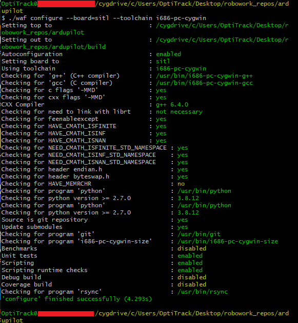

# Building ArduPlane - arduplane firmware #
This document is to simplify the main ArduPilot project BUILD.md file for ArduPlane firmware update.  

More details at Main project [BUILD.md](https://github.com/robowork/ardupilot/edit/feature/set_position_target_local_ned/BUILD.md)

Clone the project from GitHub:
```sh
git clone https://github.com/robowork/ardupilot.git
cd ardupilot
git submodule update --init --recursive
```

## Dependencies ##
- Windows environment
    - Cygwin Terminal (https://ardupilot.org/dev/docs/building-setup-windows-cygwin.html)  

    - Make sure all the required packages have been selected and installed  
    (autoconf, automake, ccache, cygwin32-gcc-g++, gcc-g++, git, libtool, make, gawk, libexpat-devel, libxml2-devel, libxslt-devel, python37, python37-devel, python37-future, python37-lxml, python37-pip, procps-ng, gdb, ddd, zip)  

    - Set Python 3.7 to be the default Python and then install additional Python packages. Open the “Cygwin Terminal” application from the desktop or start menu icon. Enter the following commands:
    ```sh
    ln -s /usr/bin/python3.7 /usr/bin/python
    ln -s /usr/bin/pip3.7 /usr/bin/pip
    pip install empy pyserial pymavlink
    ``` 


(Note: ArduPlane.exe is generated in Windows environment)
## Basic usage ##

* **Build ArduPlane**  
    Run Cygwin Terminal from desktop as an Administrator

    ```sh
    cd <directory to Ardupilot repo>
    ./waf configure --board=sitl --toolchain i686-pc-cygwin
    ./waf -j8 plane
    ```  
    After compilation, `ArduPlane.exe` file which is generated in `~/ardupilot/build/sitl/bin/arduplane.exe` can be copy & paste to MissionPlanner sitl directory which is in `~/Documents/Mission Planner/sitl`.  

* **Helpful Tips**

    - If receiving ` [errno 13] permission denied: 'c:\\cygwin64\\tmp\ `, reinstall Cygwin with required packages, and make sure that gcc compiler and other module paths are detected from `usr/bin/..` as in the picture below. If `C:/Users/..` directory is detected, check path in `Environment Variables -> System Variables -> Path` and delete the issue-related path.
      
    
    - If the build fails and receiving `ModuleNotFoundError: No module named 'future'` install future:  
    ```sh
    pip3 install future
    ```  
